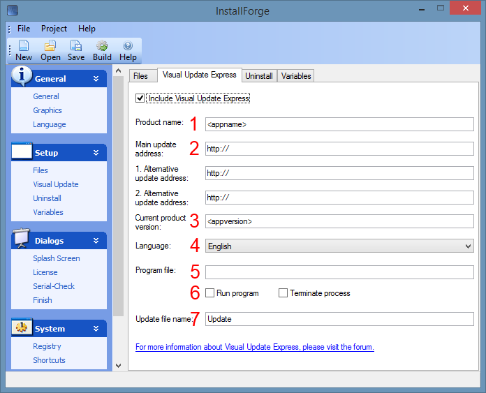

# Quick Start Guide

## Overview

This section is intended for those users who are using Visual Update Express for the first time and want to familiarize
themselves with the basic functions within a brief period of time. It is assumed here that the Visual Update Express
build system has already been successfully [installed](installation.md) together with InstallForge on the build
environment.

In the subsequent sections, you will become familiar with these subjects:

- Overview of the graphical user interface (GUI) in InstallForge for creating DUP's
- Building a DUP for a fictitious software application and bundling it within an InstallForge setup package

!!! info

    As an exclusion, no detailed information regarding the utilization of InstallForge is provided here. To learn more
    about InstallForge, refer to its own [documentation](https://installforge.net/docs/).

## Scenario

Within the scope of this page, the following fictitious scenario is assumed:

Your company _myCompany_ has developed a client-desktop application, named _myApp_, specifically
for the Windows operating system, and now you want to bundle the very first release (version `1.0.0`) together with a
DUP into a self-contained, standalone setup package using InstallForge. _MyApp_ will be installed by end-users on their
local machines ([target environment]) running different Windows operating systems (such as Windows 7, 10 and 11).

The purpose of the DUP is to enable your end-users to conveniently update _MyApp_ to future releases on their local
machines, without the need to download and install future releases of _MyApp_ again.

!!! info

    It is assumed here that the setup package has already been configured in InstallForge.

You have the following functional requirements for the setup package:

N/A

## Overview of the Program Files for _myApp_

The assumption here is that _myApp_ has already been built (i.e., the executable has been compiled) and all the
required program files are located in an arbitrary folder on the [build environment]. The content of this folder is
supposed to look like this:

```
+--- assets
|   +--- someAsset.dat
|   +--- VC_redist.x86.exe
+--- docs
|   +--- myAppDoc.html
+--- lib
|   +--- someLib.dll
+--- license.txt
+--- myApp.exe
```

As you can see, the executable `myApp.exe` of _myApp_ is located at the top level of the folder.

## Configuring and Building the DUP on the [Build Environment]

### Configuring the DUP

In order to configure the DUP, switch to the `Visual Update Express` section first in InstallForge. Then, activate
the `Include Visual Update Express` checkbox. By activating this checkbox, a DUP will be generated by InstallForge
when building a setup package based on the provided user configuration.

<figure markdown>
  
  <figcaption>Visual Update Express Section in InstallForge</figcaption>
</figure>

Different input fields are available on the `Visual Update Express` section to configure the DUP (as depicted in the
picture above), which are explained below.

`Product name`

: This field specifies the name of your software product which will be displayed in the DUP graphical user interface.

`Main update address`

: This field specifies the web URI Visual Update Express will use to download the script file and updates for your
software application. The URI must specify the protocol (`http` or `https`), the host name and a valid path pointing to
a folder hosted on your web server, where the script file (named `updatescript.ini`) and a folder (named `Updates`)
reside.

_Example_: `https://update.somedomainname.com/MyApp/`

`1. Alternative update address`

: This field specifies a web URI which will be used by Visual Update Express in case the host provided
for `Main update address` cannot be reached.

`2. Alternative update address`

: This field specifies a web URI which will be used by Visual Update Express in case the host provided
for `1. Alternative update address` cannot be reached.

`Current product version`

: This field takes the current version of your product you ship together with the DUP. This version (defined
as a string) will be used by Visual Update Express in order to determine whether a new version of your software product
is available or not.

`Language`

: The language you want to configure for the DUP graphical user interface.

!!! important

    Once the DUP has been built, the language cannot be changed afterwards. 

`Program file`

: Use this field to specify the path of the main executable of your software (main entry point) from the perspective of
the [target environment]. Visual Update Express can use this information to terminate (6) your program before updating
and restarting (6) it again when an update progress is finished.

`Run program`

: When activated, Visual Update Express will run the executable file specified in `Program File` in these 2 cases:
- When the user closes the DUP wizard on the first dialog window.
- After your software product has been updated successfully.

`Terminate process`

: When activated, Visual Update Express will kill the process associated with the executable file specified in
`Program file` right before starting to update your software product.

`Update file name`

: Executable file name of the DUP to be built.

For our scenario in consideration, we will use the following configuration:

| Input Field                     | Value                                  |
|---------------------------------|----------------------------------------|
| `Product name`                  | MyApp                                  |
| `Main update address`           | https://www.myfictionalapp.com/Update/ |
| `1. Alternative update address` | _empty_                                |
| `2. Alternative update address` | _empty_                                |
| `Current product version`       | 1.0                                    |
| `Language`                      | English                                |
| `Program file`                  | MyApp.exe                              |
| `Run program`                   | :tick:                                 |
| `Terminate process`             | :tick:                                 |
| `Update file name`              | Update                                 |

### Building the DUP

Now that we have fully configured our DUP, we are going to build it together with the setup package in the final step:

1. In InstallForge, click `Build` in the `Build` category listed in the left pane.
2. On the main pane, provide a valid path for the setup file.
3. In the main menu, click `Build` → `Build Setup`. Alternatively, press ++f5++.

!!! success

      Provided your configuration does not contain any errors, the DUP together with the setup package should now be
      built successfully.

When the user installs your application with the provided setup package wizard, the DUP (comprising the `Update.exe`file
) will be installed inside the root installation folder[^1].

[^1]: Typically `C:\Program Files\MyCompany\MyApp\`

## Configuring the Server Environment

This section addresses the [server environment] needs to be setup up which the generated DUP from the last section will
use to gather the necessary data for updating _MyApp_. As stated in the [System Prerequisites](system-prerequisites.md)
page,you only need a simple HTTP server operating, whose host name must match with that provided
in `Main update address`.

In the first step, we will manually create the update script file (`updatescript.ini`) on the HTTP server via SSH.
Alternatively, you may create the file on your local machine (such as the [build environment]) and upload it via FTPS
or SFTP.

To employ the method via SSH, follow these steps:

1. Launch your local system shell and establish a secured connection to the [server environment] by executing the
   following command-line:

```shell
$ ssh <UserName>@<HostName>
```

2. Once connected to the host, switch (`cd`) to the root web folder.
3. Create an empty folder named `MyApp` and switch to it: `mkdir MyApp && cd MyApp`
3. Create an empty file named `updatescript.ini`:

```shell
$ touch updatescript.ini
```

4. Open the file `updatescript.ini` with any text editor such as _nano_ or vim_ and paste the following content to it.

```
releases{
1.0.0
}

release:1.0.0{

}
```

5. Create an empty folder named `Updates`: `mkdir Updates`

## Releasing a New Version

In the next step within the scope of the considered scenario, we will assume that you are about to release a new
version (`1.1.0`) of _MyApp_. From the initial version `1.0.0` to version `1.1.0`, the following files have been
changed:

```
+--- lib
|   +--- someLib.dll
+--- myApp.exe
```

Up to now, these files are only available on the [build environment].

In order for these changes to be available for your shipped DUP's, you will need to apply changes on the
[server environment] as follows:

1. Launch your local system shell and establish a secured connection to the [server environment] by executing the
   following command-line:
```shell
$ ssh <UserName>@<HostName>
```
2. Once connected to the host, switch (`cd`) the folder `MyApp` located in the web root folder.
3. Open the file `updatescript.ini` with any text editor of your choice and replace its content with the following:
```
releases{
1.0.0
1.1.0
}

release:1.0.0{

}

release:1.1.0{
DownloadFile:MyApp.exe,
DownloadFile:someLib.dll,lib\
}
```
4. Upload the files `MyApp.exe` and `someLib.dll` from the [build environment] to the folder `Updates` on
   the [server environment][^2]

[^2]: For instance via the `rsync` or `scp` command-line tools.

!!! success

    That's all. The new version of _MyApp_ is now available to all end-users. Next time they launch the DUP wizard,
    they will be notified about the new version and offered to perform an update.
